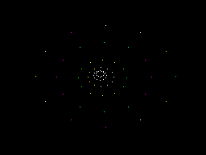
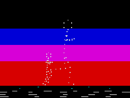
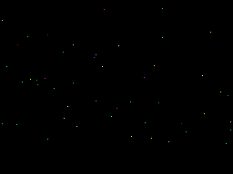
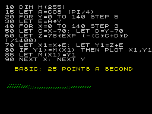
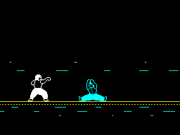
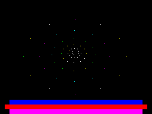

<div align="center">

# Aura Tunnel

**A 48K ZX Spectrum demo, written in Z80 assembler.**

[](#run-it-in-30-seconds)
[](src/main.asm)
[](#how-it-holds-50-fps)
[](https://github.com/danamini/aura-tunnel/releases/latest)
[-lightgrey)](LICENSE)

Ten scenes. 69,888 T-states a frame. All the trig was paid for at build time. The stack pointer is the renderer.

Sister project of **[Spectrum Aura](https://github.com/danamini/spectrum-aura)** — the browser audio visualiser that inspired the tunnel.

</div>

Aura Tunnel is a real, runnable demoscene-style production for the 48K ZX Spectrum: a ten-scene show that flies down a tunnel of streaming pixels, turns a plane beneath you, tumbles dither-shaded solids, races a sunset, plots the classic BASIC 3D graph at machine-code speed, and ends with a kung-fu bout on a moving train — every scene at 50 fps, single-buffered, racing the raster beam.

The house rule, stolen from the demos of the era: **the Z80 never computes what the build machine can precompute.** A Python generator bakes every map, palette, projection, sprite and note table; at runtime the CPU only copies, pops and looks things up.

## Screenshots

<table>
	<tr>
		<td></td>
		<td></td>
		<td></td>
	</tr>
	<tr>
		<td></td>
		<td></td>
		<td></td>
	</tr>
	<tr>
		<td></td>
		<td></td>
		<td></td>
	</tr>
	<tr>
		<td></td>
		<td></td>
		<td></td>
	</tr>
</table>

## Run it in 30 seconds

**In your browser (easiest):** download `aura-tunnel.sna` from the **[latest release](https://github.com/danamini/aura-tunnel/releases/latest)**, open **[JSSpeccy](https://jsspeccy.zxdemo.org/)**, click **Open file**, and pick the snapshot. It boots straight into the show.

**In a desktop emulator:** any Spectrum emulator that loads `.sna` snapshots works (ZEsarUX, Fuse, Spectaculator, Retro Virtual Machine…). The snapshot is the whole demo — no tape loading, no commands. (Building it yourself produces the same files in `build/`.)

**On real hardware:** use `aura-tunnel.tap` from the release with a tape interface (TZXDuino, DivMMC, etc.):

```
LOAD ""
```

then start the tape. The 48K build runs on any 48K/128K machine; the 128K build needs a 128K, +2, +2A or +3.

### Two editions

`make` builds both. They are the same demo from the same source; the 128K
build adds what the extra hardware pays for.

| | `aura-tunnel` | `aura-tunnel-128` |
|---|---|---|
| Machine | 48K, runs on anything | 128K / +2 / +2A / +3 |
| Sound | silent | three-channel AY |
| Lower third | scroller | scroller + AY level meters |
| Frame | 69,888 T | 70,908 T |

The 128K edition's music is a baked per-frame AY register stream: pitch,
harmony and all three volume envelopes are resolved in Python at build time, so
the player is a copy loop costing about 0.1 fps. The three channel volumes sit
at a fixed offset in each frame's record, which is what drives the level meters
— they read the score, not the chip.

The meters live in rows 21-23 for a timing reason. The interrupt fires at the
top of the frame and the beam does not reach the lower third until roughly
43,500 T-states later, against 14,400 for the top row. Down there a full
attribute repaint cannot be caught mid-write, so the console is the last thing
`MAIN` calls and it never tears. Contention is identical across all three
screen thirds — the lower third isn't faster, it just gives you more warning.

They also cost nothing, because they repaint only the cells that changed. A
level moves a step or two a frame, so that's two to four cells rather than 96 —
blanking and redrawing the lot measured a clean 4 fps off the tightest scene.
Through a dissolve the strip stands while the scene changes behind it; through
a slide it stands down, because a shifting screen drags the bars along and
smears them. See [docs/128k-integration.md](docs/128k-integration.md).

### Keys

| Key | Action |
|-----|--------|
| `M` | toggle the music (128K edition) |
| `Q` | quit (resets the machine to BASIC) |

## The show

| # | Scene | What's happening underneath |
|---|-------|------------------------------|
| 1 | **BRIEFING** | Double-height mission text types on behind a blinking block cursor |
| 2 | **DOT TUNNEL** | Rings of single pixels streaming outward along baked trajectories, spinning and bending on a travelling sine |
| 3 | **ROTO GRID** | A plane seen from above, turning and breathing: an attribute tile field and a hi-res dot lattice on its corners, both off one rotation, with a colour wash sweeping down it |
| 4 | **STAR SNAKE** | A sine-wave text scroller under two layers of drifting stars and a tumbling satellite |
| 5 | **SINE SCROLL** | Big pixel letters scrolling one pixel a frame, every screen column at its own height off a travelling sine — no attributes involved in the letterforms at all |
| 6 | **SOLID CUBES** | Driller-style solids: faces scan-filled through a Bayer matrix at build time, so a one-bit screen shades |
| 7 | **DOT RUNNER** | A runner drawn as 36 dots on his joints, off real running kinematics — knee to 105° at mid-swing, and a bob that drops at each footstrike |
| 8 | **DEEP SPACE** | 48 coloured stars in three parallax layers |
| 9 | **3D GRAPHS** | The famous BASIC hidden-line surface plot — first at 1982 speed with its listing on screen, then swept on at 64 points a frame in height-mapped colour |
| 10 | **NIGHT TRAIN** | Two Yie Ar Kung-Fu fighters spar on a flatbed wagon, three bands of scenery tearing past at their own rates, the deck rocking under them |

DOT TUNNEL, ROTO GRID, SINE SCROLL, SOLID CUBES, 3D GRAPHS and NIGHT TRAIN each run a double-length slot. Sixteen slots of 256 frames make a full cycle of 81.9 seconds. Scene changes take it in turns. One dissolves the outgoing image cell by cell on the same ordered-dither matrix the cubes are shaded with; the next slides the incoming scene's stage down over it, dissolving what is left below the moving edge. Both hold their frame rate, because the slide moves the curtain rather than the picture — see the frame-rate note below for why that distinction is the whole game.

## Building

Requirements: **python3** (with **Pillow**, for slicing the fighter sprites) and **[sjasmplus](https://github.com/z00m128/sjasmplus)** at `bin/sjasmplus`:

```bash
pip3 install pillow
git clone https://github.com/z00m128/sjasmplus && cd sjasmplus && make
mkdir -p ../aura-tunnel/bin && cp sjasmplus ../aura-tunnel/bin/
cd ../aura-tunnel && make          # -> both editions, .sna + .tap each
```

`tools/gen_tables.py` bakes ~22KB of tables — dot trajectories, dither-shaded cube sprites, running-gait poses, surface plots, rotation tables — and generates Z80 source as well: `build/snake.asm` and `build/bigscr.asm` are one specialised routine per case, so the inner loops branch on nothing.

## Testing

```bash
make emu     # launch ZEsarUX with the 48K demo + remote protocol
make emu128  # the 128K edition, on its own port so both can run at once
make test    # artifact checks, full playlist cycle, per-scene fps floors

python3 tools/smoke_test.py --128   # same, against the 128K edition
```

The smoke test drives ZEsarUX over its ZRCP remote protocol: it reads the demo's own frame counter out of emulated RAM to prove every scene holds its frame-rate floor, pinning each scene by rewriting the playlist live in memory. `tools/zrcp_scr.py` captures tear-free PNGs the same way (it freezes the CPU around the dump).

## How it holds 50 fps

A PAL Spectrum frame is 69,888 T-states of a 3.5MHz Z80 — and there's no double buffer here, so every scene draws ahead of the raster beam, top-down, each cell written exactly once per frame.

- **Bake it, don't compute it** — the cubes were first written as a live scanline filler with Bresenham edge chains. It worked, and it cost ~90k T-states against the 69,888 there are. The shading moved into `gen_tables.py`, where each face is scan-filled through a Bayer matrix for free, and the Z80 got back a flat sprite blit. Same look, 50 fps.
- **The stack pointer is a register you can spare** — renderers `POP` baked bytes two at a time, or `PUSH` them: 11 T-states a pair against 24 a byte. Nothing may `CALL` while SP walks data, so returns are self-modified `JP`s.
- **Erase from what you know, never by clearing** — every dot renderer caches the address and mask of each pixel it sets and unplots exactly those next frame. The sunset behind the runner is painted once at scene entry and never touched again.
- **Generated Z80** — `snake.asm` and `bigscr.asm` emit one specialised routine per case (per wave offset, per start-scanline phase), so screen-address arithmetic is baked into the instruction stream instead of computed in the loop.
- **Self-modifying code** — scene dispatch, loop bounds, colour and sprite pointers are all patched immediates.
- **Scene changes alternate** — a Bayer dissolve, then a slide. Both are cheap, and the slide is cheap for a reason worth stating: it moves the *curtain*, not the picture. The incoming stage slides down over the frozen outgoing image, so each step costs one character row — 256 bitmap bytes and 32 attributes — because rows already covered stay covered. The first version dragged all 5,888 bytes of the outgoing image upward every step instead, and measured 275,670 T-states a step: 3.94 frames, 12.7 fps, 1.9 seconds. There is no hardware scroll on a Spectrum, so if something must appear to move, move the thing with less of it.

Two things this codebase learned the hard way and both are measurement lessons, not coding ones: hand-counted T-state estimates here ran about **half** the true cost, every time; and frame rate is quantised to 50/N, so a scene sitting near the boundary reports 25.8 against 29.6 for a genuinely large saving. Temporary counters incremented in the hot routine and read back over ZRCP beat both.

Memory is effectively full: code and hot data above `$8000` (uncontended), cold one-shot code and sprite data from `$5E00`, baked tables from `$A000` to the top. The 128K build changes none of that — it adds one 16K page holding the AY score, swapped in for the few hundred T-states the player needs it and swapped straight back out, because the stack lives in the window it borrows.

## Credits & licence

Code and generated assets are MIT licensed — see [LICENSE](LICENSE).

**Exception:** the dojo fighters are sprites from Konami's *Yie Ar Kung-Fu* (ZX Spectrum, 1985), sourced from [The Spriters Resource](https://www.spriters-resource.com/zx_spectrum/yiearkungfu/) (`assets/oolong-sheet.png`). They remain © Konami, are included for personal/educational fun only, and are **not** covered by the MIT licence. The Sinclair ROM font is read from the machine's own ROM at runtime and is not distributed.

Built as a love letter to the 48K demoscene, alongside [Spectrum Aura](https://github.com/danamini/spectrum-aura).
