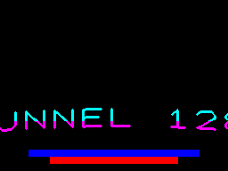
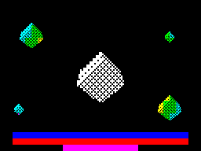
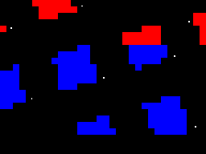

# Aura Tunnel

A ZX Spectrum demo written in Z80 assembler, with silent 48K and AY-powered
128K editions. Ten scenes combine a dot tunnel, rotating grid, shaded cubes,
scrollers, motion-capture runners, starfield, live ROM BASIC and a train-top fight.

Most animation uses build-time tables. The BASIC interlude deliberately does its
calculation in the Spectrum ROM, with its source visible on screen.
[Spectrum Aura](https://github.com/danamini/spectrum-aura) is the separate browser
visualiser that inspired this project.

## Current build

- The big sine scroller runs at about 50 FPS, one pixel per frame, for about
  31 seconds. It sits lower on the screen in the 128K edition.
- Roto retains the original rotation/zoom motion and white-dot lattice, with
  complete-frame copying at about 25 FPS.
- The white central cube and four companions move independently. The central
  cube's phase and erase alignment are covered by regression checks.
- The graph scene shows a **15-second real BASIC preview**, then switches to
  labelled, precalculated Z80 plots. The old “25 BASIC points per second” claim
  has been removed.
- The 128K edition adds a four-section AY arrangement and level meters. Music
  is interrupt-driven and continues during BASIC.

Frame rates above are simulation measurements. See the
[delivery status and remaining UAT](docs/improvement-plan.md),
[128K implementation](docs/128k-integration.md) and
[BASIC implementation and benchmark](assets/basic/README.md).

## Screenshots






These images are captured from the assembled snapshots in the runtime simulator.

## Build and run

Install Python 3 and put `sjasmplus` at `bin/sjasmplus` (tested with 1.23.1).
The fighter sprite generator also requires Pillow.

```sh
python3 -m venv .venv
.venv/bin/pip install pillow -r tools/requirements-test.txt
make all PYTHON=.venv/bin/python
```

Build outputs are `build/aura-tunnel.sna` and `build/aura-tunnel-128.sna`, with
matching `.tap` files. Load the appropriate snapshot in ZEsarUX, or use:

```sh
make emu       # 48K, remote protocol port 10777
make emu128    # 128K, remote protocol port 10778
```

The Makefile defaults to the macOS ZEsarUX application path; override `ZESARUX`
for another installation. Published [releases](https://github.com/danamini/aura-tunnel/releases)
may predate the current source. Snapshot execution has been checked in simulation
and ZEsarUX; TAP loading and physical hardware remain unverified for this revision.

During machine-code scenes, **M** toggles 128K music and **Q** resets to BASIC.
The ROM preview has its own keyboard handling and returns automatically after
15 seconds.

## The show

1. **Briefing:** double-height text types on with a block cursor.
2. **Dot tunnel:** pixel rings follow baked, bending trajectories.
3. **Roto grid:** an attribute plane and matching white dots rotate and zoom.
4. **Star snake:** a small sine scroller and satellite cross a starry sky.
5. **Sine scroll:** original 32×24 lettering follows a travelling wave.
6. **Solid cubes:** a white dithered hero cube and four coloured companions.
7. **Dot runner:** three independently paced runners derived from CMU clip 09_01;
   the main runner uses 12 poses with 64 points.
8. **Deep space:** parallax stars with clipped trails and larger foreground cores.
9. **3D graphs:** real ROM BASIC followed by precalculated colour plots.
10. **Night train:** two Yie Ar Kung-Fu fighters on a moving flatbed wagon.

The playlist repeats scenes across 20 slots, including six big-scroller slots.
Slots count renderer frames, so roto and BASIC affect elapsed show time. Scene
changes alternate a dissolve and a descending reveal. The fight scene's rendering
and placement were preserved in the latest follow-up.

## Verification

```sh
make test-runtime PYTHON=.venv/bin/python
.venv/bin/python tools/runtime_test.py --shots build/runtime-shots
```

The 13-test suite executes both snapshots using SkoolKit 10.1 with interrupts
and ULA contention. It checks scene timing, cube and roto scanout, cube alignment,
scroller motion, starfield title phases, trail cleanup, meter contents, AY cadence,
and BASIC's timeout and memory restoration. It does not modify the desktop emulator.

The optional `make test` / `tools/smoke_test.py --128` checks build artifacts and,
when ZEsarUX is reachable, runs live tests that rewrite its playlist. Reload the
snapshot afterward for normal viewing. `make cleanbuild` deletes `build/` and
rebuilds both editions; use a separate checkout when preserving UAT artifacts.

## Source layout

- `src/main.asm`: scene renderers, transitions, playlist and memory layout.
- `src/basic.asm`: ROM entry, timed preview and demo restoration.
- `src/ay128.asm`: interrupt-driven AY playback and level meters.
- `tools/gen_tables.py`, `gen_font.py`, `mocap_runner.py`: baked animation,
  generated drawing routines and original large lettering.
- `tools/gen_ay128.py`: the AY register stream.
- `tools/basic_graph_program.py`: shared BASIC source and tokenisation.
- `assets/basic/`: generated interpreter entry context; no ROM image.

The packed memory layout uses cold code/data below `$8000` and resident code,
working buffers and tables above it. BASIC temporarily borrows and restores
part of the roto table. The 128K player briefly pages in a separate music bank;
its stack safety constraints are documented in the integration notes.

## Credits and licence

Code and original generated assets use the [MIT licence](LICENSE).
The Yie Ar Kung-Fu fighter artwork (`assets/oolong-sheet.png`), sourced from
[The Spriters Resource](https://www.spriters-resource.com/zx_spectrum/yiearkungfu/),
remains © Konami and is excluded from that licence. The ROM font is read from
the machine at runtime, not distributed.

Runner motion comes from CMU Graphics Lab clip 09_01, converted to BVH by
Bruce Hahne; see [source and acknowledgments](assets/mocap/SOURCE.md).
The music combines Korobeiniki, Beethoven's Ode to Joy, and original melodies
Neon Drive and Night Flight, with project-original arrangements.
