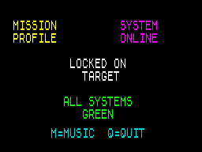
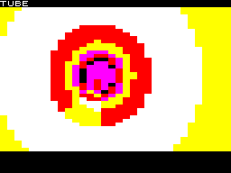
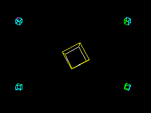
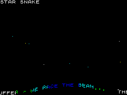
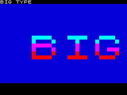
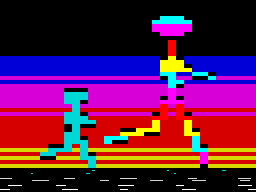
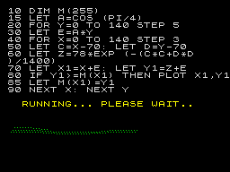
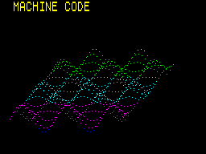
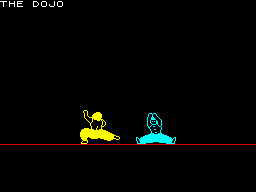

<div align="center">


[](#run-it-in-30-seconds)
[](src/main.asm)
[](#how-it-holds-50-fps)
[](#the-music)
[-lightgrey)](LICENSE)


Sister project of **[Spectrum Aura](https://github.com/danamini/spectrum-aura)** — the browser audio visualiser that inspired the tunnel.

</div>

Aura Tunnel is a real, runnable demoscene-style production for the 48K ZX Spectrum: an eleven-scene show that flies down attribute tunnels, spins wireframe cubes, races a sunset, plots the classic BASIC 3D graph at machine-code speed, and ends in a kung-fu dojo — every scene at a locked 50 fps, single-buffered, racing the raster beam.

The house rule, stolen from the demos of the era: **the Z80 never computes what the build machine can precompute.** A Python generator bakes every map, palette, projection, sprite and note table; at runtime the CPU only copies, pops and looks things up.

## Screenshots

<table>
	<tr>
		<td></td>
		<td></td>
		<td></td>
	</tr>
	<tr>
		<td></td>
		<td></td>
		<td></td>
	</tr>
	<tr>
		<td></td>
		<td></td>
		<td></td>
	</tr>
</table>

## Run it in 30 seconds

**In your browser (easiest):** open **[JSSpeccy](https://jsspeccy.zxdemo.org/)**, click **Open file**, and pick `build/aura-tunnel.sna`. It boots straight into the show.

**In a desktop emulator:** any Spectrum emulator that loads `.sna` snapshots works (ZEsarUX, Fuse, Spectaculator, Retro Virtual Machine…). The snapshot is the whole demo — no tape loading, no commands.

**On real hardware:** use `build/aura-tunnel.tap` with a tape interface (TZXDuino, DivMMC, etc.):

```
LOAD ""
```

then start the tape. It is a 48K program and runs on any 48K/128K machine.

### Keys

| Key | Action |
|-----|--------|
| `M` | toggle the beeper music |
| `Q` | quit (resets the machine to BASIC) |

## The show

| # | Scene | What's happening underneath |
|---|-------|------------------------------|
| 1 | **BRIEFING** | Double-height ROM-font mission text types on, with a flashing status line |
| 2 | **TUBE** | The chunky attribute tunnel: SP pops baked maps at 43 T-states a cell |
| 3 | **STAR SNAKE** | A sine-wave text scroller, every character at its own height, under drifting stars |
| 4 | **BOX** | The tunnel again with square geometry |
| 5 | **BIG TYPE** | 64×64-pixel gradient letters bouncing on a sine |
| 6 | **STAR** | The tunnel, star-shaped |
| 7 | **SUNSET RUN** | An articulated stick man on a parallax speed-line floor, with a half-size companion behind him |
| 8 | **VECTOR CUBE** | True hi-res Bresenham wireframe tumbling in perspective, four baked companion cubes in the corners |
| 9 | **DEEP SPACE** | 48 coloured stars in three parallax layers |
| 10 | **3D GRAPHS** | The famous BASIC hidden-line surface plot — first at 1982 speed with its listing on screen, then swept on at 64 points a frame in height-mapped colour |
| 11 | **THE DOJO** | Two Yie Ar Kung-Fu fighters spar through a 32-step scripted bout |

Scenes 3, 5 and 10 run double-length slots; a tunnel breathes between each feature. A full cycle is about 72 seconds.

## Building

Requirements: **python3** (with **Pillow**, for slicing the fighter sprites) and **[sjasmplus](https://github.com/z00m128/sjasmplus)** at `bin/sjasmplus`:

```bash
pip3 install pillow
git clone https://github.com/z00m128/sjasmplus && cd sjasmplus && make
mkdir -p ../aura-tunnel/bin && cp sjasmplus ../aura-tunnel/bin/
cd ../aura-tunnel && make          # -> build/aura-tunnel.sna + .tap
```

`tools/gen_tables.py` bakes ~35KB of tables (tunnel maps, palettes, cube projections, walk cycles, surface plots, the musical score) and even generates Z80 source (`build/snake.asm`, one specialised blit routine per scroller offset).

## Testing

```bash
make emu     # launch ZEsarUX with the demo + remote protocol
make test    # artifact checks, full playlist cycle, per-scene fps floors
```

The smoke test drives ZEsarUX over its ZRCP remote protocol: it reads the demo's own frame counter out of emulated RAM to prove every scene holds ≥49 fps, pinning each scene by rewriting the playlist live in memory. `tools/zrcp_scr.py` captures tear-free PNGs the same way (it freezes the CPU around the dump).

## How it holds 50 fps

A PAL Spectrum frame is 69,888 T-states of a 3.5MHz Z80 — and there's no double buffer here, so every scene draws ahead of the raster beam, top-down, each cell written exactly once per frame.

- **Chunky 32×42 half-block mode** — every cell's bitmap is top-half `$00`, bottom-half `$FF`, so PAPER colours the top half-block and INK the bottom. A whole tunnel frame is 672 attribute writes.
- **The stack pointer is the renderer** — inner loops `POP` baked map bytes two at a time with interrupts off. Nothing may `CALL` while SP walks data; returns are self-modified `JP`s.
- **Per-frame 256-byte LUTs** — rotation and forward motion collapse into one table rebuild, then the hot loop is pure lookups. Motion and rotation are 8.8 fixed-point accumulators.
- **Self-modifying code everywhere** — scene dispatch, plot direction, colour masks, loop bounds and sprite pointers are all patched immediates.
- **Baked everything** — 128 cube rotations, 8 stick-man poses, hidden-line graph points, even the companion cubes are pre-rasterized sprites because real Bresenham is too dear at 16×16.
- **The music rides the slack** — one baked note burst per frame in whatever T-states the scene left over, half-length in the three tightest scenes.

Memory is effectively full: code and hot data above `$8000` (uncontended), cold one-shot code and sprite data from `$5E00`, baked tables from `$A000` to the top, with the per-frame LUT at `$FF00`.

## Credits & licence

Code and generated assets are MIT licensed — see [LICENSE](LICENSE).

**Exception:** the dojo fighters are sprites from Konami's *Yie Ar Kung-Fu* (ZX Spectrum, 1985), sourced from [The Spriters Resource](https://www.spriters-resource.com/zx_spectrum/yiearkungfu/) (`assets/oolong-sheet.png`). They remain © Konami, are included for personal/educational fun only, and are **not** covered by the MIT licence. The Sinclair ROM font is read from the machine's own ROM at runtime and is not distributed.

Built as a love letter to the 48K demoscene, alongside [Spectrum Aura](https://github.com/danamini/spectrum-aura).
